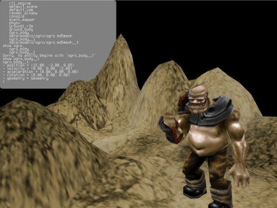

% Specialization in ooc
% Amos Wenger
% June 8, 2012

# Abstract

The purpose of this project is to optimize the performance of generics in the
ooc programming language via the implementation of specialization in rock, its
main compiler.

# The ooc programming language

ooc is a general-purpose programming language I designed in early 2009, in
order to be able to write an EPFL assignment in an object-oriented language
rather than directly in C.

The first ooc-to-C compiler implementation was done in Java, and didn't feature
any compile-time checks. Many iterations later, the ooc compiler is now
self-hosting (written in ooc itself) and has been successfully tested on a
wide array of platforms, from Windows, to Linux, to OSX, FreeBSD and OpenBSD.

The ooc language is very versatile, and lends itself easily to the same kind
of experiments one would use C in: for example, a fork of the ooc SDK was made
compilable for the TI-89 calculator. There have also been successful attempts
to use ooc on Haiku OS, the modern clone of BeOS.

## ooc vs C++

ooc is in some ways comparable to C++. The original meaning of ooc was *object-
oriented C*, which is similar in spirit to C++'s *c with classes*. However,
there are a few marked differences.

The first and foremost difference is that ooc intends to remain a
source-to-source language: even though we might consider alternative backends,
such as LLVM, the JVM, etc., in spirit, ooc is a language that remains usable
because even though it is not widespread, it produces readable C output that
is familiar to a whole generation of programmers.

ooc also tries to be leaner than C++: it has fewer features, while still
remaining general enough to be relevant for most tasks. Another distinctive
difference is in the implementation of generics versus templates.

## ooc vs C#/Java

As far as class-oriented languages go, C# and Java are arguably the two most
notable running on VMs. The fact that ooc's initial implementation does not
run in a virtual machine is a deliberate decision: while a VM allows JIT
optimizations, and wider facilities to debug an application, I saw it as a
challenge to work on AOT[^aot] optimizations instead, and make the output portable
enough that a whole VM wouldn't be required to run it.

[^aot]: Just In Time (JIT) optimizations require programs to be ran on a virtual
    machine that has enough insight to be able to modify the program while it is
    running in order to make it run faster. Ahead Of Time (AOT) optimizations
    are made purely at compile time, and makes usage of static analysis and
    other such techniques in order to predict as accurately as possible the
    cases for which it is worth optimizing.

    While criticisms apply to both approaches, Profile Guided Optimization (PGO)
    seems to combine the best of both worlds: it doesn't incur the classical
    cost of a VM start-up, while still retaining the relevance of JIT
    optimizations based on real-world data from actual runs.

Note that even though (obviously) binary executables produced by the C compiler
are not portable, the C source is: that is, rock (the ooc compiler) will produce
the same C code on Linux, Windows, and OSX: that code will contain the necessary
preprocessor directives for it to compile and run on the platforms cited above.
Platform-specific code can be written in ooc thanks to version blocks.

As far as debugging, profiling, and general insight into a program goes, in
practice I have found that classical instrumentation tools such as gdb,
valgrind, gcov, gprof, etc. all worked very well. Since #line instructions are
outputted, it is even possible to step through ooc code in gdb, for instance.

## Generics

### Generic functions

`identity` is the canonical generic function: it simply returns exactly
what has been passed to it.

\input{excerpts/generics-001.ooc.tex}

Generics are reified, so that generic type parameters can be inspected at
runtime, like this:

\input{excerpts/generics-002.ooc.tex}

A limited amount of matching can be done on the type of a generic argument:

\input{excerpts/generics-match.ooc.tex}

More advanced matching can also be done on the generic argument itself,
alleviating the need for explicit casts.

\input{excerpts/generics-match2.ooc.tex}

### Generic classes

Classes in ooc accept type parameters as well. A simple generic container
could be implemented like this:

\input{excerpts/generics-container.ooc.tex}

A prime example of generics usage in the ooc codebase is the 'structs' package,
containing various collections[^go-collections].

\input{excerpts/generics-collection.ooc.tex}

[^go-collections]: However, to the difference to the Go language, any class
    accepts generic type parameters, not only collections.

Classes and functions accept any number of generic parameters:

\input{excerpts/generics-kv.ooc.tex}

## Types

### Covers

The reason the `repr` function above cannot be simply handled with a virtual
method call is that, in ooc, not everything is an object. Types like `Int`
and `Octet` are covers from C types:

\input{excerpts/covers.ooc.tex}

Will print:

```
  int size = 4 bytes
octet size = 1 bytes
```

Covers generate typedefs in the C backend, and are only thin layer over a given
C type. They allow to use C libraries with an object-oriented syntax, even
though the library might have its own system of virtual function call under the
hood.[^gobject]

[^gobject]: This is the case, notably, for the GObject library. Foundation to
    all libraries GTK and Gnome, it features a remarkably complex object system
    on top of C, implemented using high-level object definition files and an
    impressiven number of generated C macros.
    <http://developer.gnome.org/gobject/>

### Classes

As in Java, all objects in ooc are references. ooc has single inheritance,
and ultimately every object inherits from the `Object` class

\input{excerpts/classes.ooc.tex}

Will print:

```
reference size = 4 bytes
 instance size = 5 bytes
```

...if the C compiler does packing. Otherwise, the char will probably get
aligned to 4 bytes, and the instance size will be 8.

# Original implementation

## Generic arguments and return types

Since generic arguments can be either basic types or object types, the code
generated can handle arguments of any size. C has no explicit support for
variable-sized types [^vlas], the implementation uses pointers to a memory area,
and memory copy operations instead of assignment.

[^vlas]: That's not entirely accurate: C99 supports VLAs (Variable-Length Arrays),
    which are allocated on the stack (like local variables of basic types in ooc),
    but their limitations render them worthless in our case: you can't return
    VLAs, and furthermore, keeping track of stack allocated memory is tricky.

Here's an example of the C code generated for the above `identity` function:

\input{excerpts/identity.c.tex}

And a call to identity, such as the following:

\input{excerpts/identity-call.ooc.tex}

Would be translated in C as:

\input{excerpts/identity-call.c.tex}

Similarly, when declaring variables of a generic type (inside a generic class,
for example), they are allocated on the heap. Although the memory is eventually
reclaimed by the garbage collector [^gc], it incurs some additional processing
(housekeeping done by the garbage collector) that would not be necessary if the
variable was simply allocated on the stack.

[^gc]: rock uses the Boehm garbage collector: <http://www.hpl.hp.com/personal/Hans_Boehm/gc/>

## Conversion

When generic variables are used in a match, or explicitly cast to a non-generic
type[^unsafe-casts], some pointer trickery is required in the generated C code. For example,
casting a generic parameter named value of type T to an integer type would look
like this:

\input{excerpts/pointer-dance.c.tex}

[^unsafe-casts]: Note that explicit casts from generic types to non-generic types
    are unsafe and generally regarded as bad practice. Using a match
    is a much safer way to deal with generic values.

## Generic pointers

Generic pointers are yet another can of worms. They can be indexed like C
arrays, getting or setting individual elements. However, since - again - the
size of the generic type is not known in advance, code like this:

\input{excerpts/genericptr.ooc.tex}

Requires non-trivial pointer arithmetic in order to maintain the semantics
of array manipulation in ooc:

\input{excerpts/genericptr.c.tex}

By default, if the last instruction of a non-void ooc function is an expression,
it is implicitly returned, which explains the second part of the generated code.

## Non-optimatility of the current approach

The current implementation of generics suffers from a few performance problems.
Because of the generality of the machine code that is eventually produced, there
is a significant amount of lost opportunity for optimization.

Given that we can infer, at compile time, the type parameters used when
instanciating certain generic classes, optimized machine code could be emitted
(through a C compiler) for a given subset of these type parameter combinations.

# Specialization implementation

The basic idea behind specialization is to turn a subset of generic instances
into template instances, statically compiled to type-specific code. For example,
the identity function as described above, when used with an integer argument,
would compile down to this specialized code:

\input{excerpts/identity-int.c.tex}

Below, we discuss of the major problems linked to the implementation of
specialization in a language such as ooc, and the methods used to circumvent said
problems.

Note that that implementation discussed in this report is available as a branch
of the rock project on GitHub[^gh-repo].

[^gh-repo]: GitHub is a general-purpose code repository and production suite for
    software developers, with an emphasis on open-source and collaboration.
    All of the code for the ooc compiler, associated tools and general
    library ecosystem around it are hosted there. It even features syntax
    highlighting for ooc.
    <https://github.com/nddrylliog/rock/tree/specialize>

## A-priori perils of specialization in ooc

Following are a list of problems that were known ahead of time and made this
project challenging. In comparison, the Post-mortem section will detail
unforeseen issues that were encountered while implementing specialization.

### Introspection

ooc features reified generics[^reified], which means that when a generic type is
instanciated, rather than erasing its type parameters, it stores them in the
class structure, next to the vtable. As a result, generic classes can be
inspected at runtime, along with their type parameters.

[^reified]: This design choice departs significantly from, for example, the Java
    language and the Scala language. The reason for that is that object
    semantics are built in the JVM. This decision, criticized by detractors of
    the JVM, makes it unnecessarily hard to implement alternate OO semantics,
    perhaps closer to the intent of Alan Kay in Smalltalk, where state is
    embraced and message-sending is the prime mechanism by which computation
    is done. However, the state of the art is changing with the JDK 7, thanks
    to the work of, among others, Charles Nutter, who played a crucial role in
    the JRuby implementation, and is now championing the development of
    invokedynamic to better serve dynamic languages on the JVM.

When specializing classes, although the generic parameters become either
partially or totally fixed at compile time, we cannot simply erase them from the
class structure, because existing code might depend on them (through
instanceOf?, or preferably, a match, as demonstrated in the examples above.)

As a result, it is necessary in the generated code, to make available generic
parameters in the specialized version just as well as in the unspecialized
version. In function-level specialization, it can be a simple local declaration,
that can be removed by an optimized compiler in case it is not being utilized.

\input{excerpts/identity-int.c.tex}

### Combinatorial explosion

Another thing to consider is the scope of the specialization: which classes and
methods to specialize, and which to leave unspecialized.

While heuristics could be developed to find out the most cost-efficient
combinations, for this project we will simply annotate by hand the methods we
feel would gain to be specialized.  That said, auto-specialization would be an
interesting topic for further research.

### Type signatures

Finally, in the context of C code generation, specialization is tricky because
the specialized and the unspecialized versions of a given method can have different
signatures, implying that they cannot be called the same way (ABI compatibility
is not maintained). However, in the event that we need to maintain the same signature,
a shim is easy to make, for example:

\input{excerpts/identity-shim.c.tex}

Note that, ironically, in order to generate a shim like the above, we have to
use the same style of checks than in the un-specialized versions (ie. making sure
the return pointer is non-null), and we have to cast the pointer type, as shown
in the Conversion section.

## AST transformations

For the purpose of this project, two types of specializations have been
implemented: function-level specialization, and class-wide specialization.

### Function-level specialization

While ooc is an object-oriented language, it allows module-level functions that
are not bound to a specific type. Those functions can be generic too, and are
potentially subject to specialization as well. In our implementation, we use the
pre-existing inline keyword to mark functions that should be specialized.

The combinations for which a generic function should be specialized are chosen
by callsite. In theory, this might lead to combinatorial explosion (as seen
above), but in practice, module-level functions are rare enough in typical ooc
code that such an implementation is still relevant.

Since the ooc AST is mutable, the first step to specializing a function is to
keep a copy of it before any AST mutation can transform it into a full-blown
generic function. In our implementation, we simply added an `inline` member to
the `FunctionDecl` AST node.

The second step is to modify the function call resolution process in order to
intercept functions that are marked as specializable. This is done by adding a
condition in the `resolveCall` function of the `FunctionCall`, that calls the
`specialize` method on the `FunctionDecl`.

In the `specialize` method, another copy of the original is made, ready to be
specialized. Then, we step through each argument of the function and change
its generic type to the type inferred from the call.

For example, if a function with generic parameter X took an argument of type X,
and was called with an argument of type Char, all references to the generic type
X would now refer to the concrete type Char.

On the side of the function call itself, nothing needs to be changed, except its
`ref`, which is a reference to the function declaration being called. This will
ensure that the correct C function is called in the generated code.

The specialized version of a function has a name composed of the name of the
original function and a unique generated suffix in order to make sure that the
additional C function generated doesn't clash with any pre-existing
code[^generating-c].

[^generating-c]: That technique, while imperfect, is used in many different
    places in the ooc compiler. Because it was designed from the beginning to
    generate C code, tradeoffs were made in order to be facilitate the work of
    the backend. In retrospect, separating cleanly the C and the ooc backend
    would have been a much cleaner alternative: this approach is taken in the
    experimental compiler, oc <https://github.com/nddrylliog/oc>, and more
    recently in the latest rewrite of rock itself. It is hoped that this clean
    separation will allow alternative backends to be implemented more easily.

### Class-wide specialization

To specialize whole classes, we have taken a different approach. Instead of
marking class declarations and determining combinations from instanciation site,
we have introduced a new keyword, `#specialize`, that accepts a fully-qualified
generic class name and marks not the class, but the combination of its generic
type parameters for specialization.

Adding this keyword required modifying the ooc PEG grammar used by rock, as it
constitutes an addition to the syntax of the language. Using it carefully in
generic code allows one to hint the compiler as to which specializations would
be the most beneficial for the performance of the program while retaining a
relatively small footprint compared to the unspecialized version.

The usage of `#specialize` triggers a copy mechanism similar to the one
described previously for module-level functions. The class variation, however,
contains a few interesting differences.

The first one is that in order to resolve generic types to concrete types, a map
from type parameter name to concrete type. This map is then used in the
resolving process to make sure that, to take the same example, any access to the
type X would in fact point to the concrete type Char.

This solves the first part of the problem, which is to actually generate a
specialized version of the class. The second part of the problem is to use this
specialized version where it can be used.

This is solved in an interesting way. `new` is not a keyword in ooc. In other
words, class instanciation is not treated specially, and as such it cannot be
easily hooked into in the compiler, except by testing against the name of the
method, but here again: there is no guarantee that this method is the actual
constructor.

In fact, in ooc, `new` is just a normal static method, which allocates an object,
assigns generic type parameters, and then calls the `init` (non-static) method on
the newly created instance, returning it shortly thereafter. Due to the flexible
nature of the language, an object could very well be created from another static
method, such as `create`, or `fromSomethingElse`[^alt-mem].

[^alt-mem]: These methods are casually utilized when the default allocation
    strategy is not deemed fit for a particular use case. In some games for
    example, a memory pool could be used for certain classes of objects subject
    to rapid creation and destruction in short-term lifes, as it would be less
    costly than letting the GC handle these memory blocks indiscriminately.

    On embedded systems, such as the TI-89, the Boehm garbage collector could
    not run at all: a manual allocation strategy was then required to make ooc
    code run on that platform. In that case, a simple correction of the core of
    the ooc object system, itself written in ooc, was sufficient.

A very elegant solution was found to this problem: it occured to me that in
order for the specialized version to be used for compatible instanciations, all
we had to do was to call the right version of the static function, be it new or
any other.

In order to achieve this, a check was added at the end of the function resolving
code (`resolveCall` in the `TypeDecl` AST node) to check if a static method call
was made on a class that had specializations. If it is the case, then we try to
match the actual type on which the static function is called to the various
specializations manually permitted in the code.

The decision whether to use a specialized version of the class or not, and which
one to use, is made by comparing the scores of different associations of types.
This method, which we could call quantitative subtyping, is used in various
places of the ooc compiler in order to allow part of the flexibility that C is
known to have as far as its type system goes. It is especially useful in the
context of C covers, where the relations between multiple covers is often fuzzy
and does not obey the rules of a classical, strict type system.

Once the specialization to be used has been determined by quantitative
subtyping, the resolution of the `ref` of the static method call is relayed to
the specialized version of the class, which will then be written just as a
normal class would.

## Compatibility with legacy code

Additions made to the compiler so that it supports specialization do not break
any existing code. In fact, it was considered to witness its effects on
inception-engine[^ic-github], an ooc game engine that is highly dynamic and allows runtime
manipulation of all entities in the game world at all times.



[^ic-github]: The source of this project, although dated, still compiles and runs
    on the current version of rock, and is available under a BSD-comaptible
    license on GitHub: <https://github.com/nddrylliog/inception-engine>

However, the usage of `#specialize` with data structures such as
`structs/ArrayList` and `structs/HashMap` causes issues with parts of the code
hand-optimized for the initial, naïve implementation of generics.

For example, the `removeAt` method calls directly `memmov` in order to copy
areas of memory efficiently (instead of moving one element at a time):

\input{excerpts/arraylist-remove.ooc.tex}

This code, instead of using generic facilities in ooc, bypasses them and
directly calls C functions for performance. Unfortunately, it does not make
sense in the context of a specialization, and prevents the current
specialization implementation to be used directly with this SDK.

A possible solution to this problem would be to extend the semantics of pointer
manipulation in ooc, and allow manipulation on ranges, so that the removeAt
method could be re-implemented as follows:

\input{excerpts/arraylist-remove2.ooc.tex}

This code, resorting to higher-level generic primitives, would then allow the
generation of both the unspecialized version (using `memmov` for fast, anysized
copying of array elements) and the specialized version.

## Benchmarking

The benchmark that we are going to use is a simple list sorting algorithm.
We will compare the respective performance of the specialized and the
unspecialized version.

\input{samples/sorting.ooc.tex}

### Source and binary size

One downside of specialization is that it produces larger source files and thus,
larger executables. This next graph shows, in bytes, the difference in size for
three files: `sorting.c`, the C file with the actual implementation of the
sorting algorith, `sorting.h`, a header file containing, among other, the
structure definitions for the vtable, and `sorting-fwd.h`, which contains public
function prototypes for an ooc module[^double-header].

[^double-header]: The ooc compiler always generate two header files for any
    module. This allows arbitrary circular dependencies within ooc modules, and
    proper forward declaration in the generated C code. Those circumvention
    mechanisms would not be necessary in a target language with a saner
    modularity paradigm, which is, unfortunately, not the case with C.

    In practice, modules which only instanciate classes or call functions from
    from the imported module, will only include the forward header
    (`module-fwd.h`), and modules which contain subtypes of the imported module
    will import the full header (`module.h`) in order to easily generate the
    hierarchical vtable structure that characterizes ooc classes.

\input{source-size-graph.tex}

As for the size of the executable, when compiled with clang, it went from 728K
to 734K with -O0, and from 672K to 674K when with -Os. The impact here is
minimal, as most of the space in the executable is occupied by the ooc SDK
itself, which is not affected by our usage of `#specialize`.

### Memory usage

### Runtime (gcc Ubuntu/Linaro 4.6.3-1ubuntu5)

The GNU Compiler Collection is the de-facto standard for open-source compilers.
It has been used for decades to build sizable collections of C and C++ programs
such as the Debian project, which contains over 29000 packages.

The following graph shows execution times in function of the size of an array
sorted using bubble sort (cf. the algorithm shown above).

\input{gcc-graph.tex}

It displays a few unintuitive results: for the unspecialized code, the
unoptimized version is faster than the version optimized for size. That means
that gcc is ready to do compromises on the performance of the program in order
to reduce the size of the executable from 710KB to 665KB.

Interestingly, on the specialized version of the program, GCC performs as
expected, ie. the `-Os` version is faster by about 60%.

### Runtime (clang version 3.0-6ubuntu3)

Clang is the gcc-compatible front-end for LLVM, an upcoming challenger to the
GNU Compiler Collection, which boasts a cleaner codebase, generally faster
compile times, and more in-depth optimizations. It now regularly beats GCC on
benchmarks, and several Linux distributions are looking forward to switch their
toolchain to it entirely[^gentoo-llvm].
 
[^gentoo-llvm]: Among them is the Gentoo project:
    <http://en.gentoo-wiki.com/wiki/Llvm>

We've run the same tests on clang that we did on GCC, in order to compare the
behavior of different C compilers and interpret them in relation to the produced
C code.

\input{clang-graph.tex}

The results are more in line with what we can expect of an optimizing compiler.
LLVM seems to strike a better compromise between code size and performance, as
the compared runtimes of the -Os and -O1 show, both in the unspecialized and
specialized version.

## Conclusion

In conclusion, the implementation of specialization in the ooc language proved
to be relatively painless due to the design of generics from the beginning.
Specialization allowed a performance gain of up to 78% in a generics-heavy
sorting benchmark.

The remnants of legacy, backend-specific code, prevent this implementation
from being useful in an even larger context, but this work constitutes a
solid basis for a new class of high-performance ooc applications, where
previously, generics types would have been discarded because of their high cost.

The result of this research will be merged in the main trunk of the `rock` ooc
compiler, along with the implementation of the new generic pointer primitives
discussed in the Class-wide specialization section, in time for the 1.0 release
of rock.

## Acknowledgements

I'd like to extend a sincere thank you to the Lab for Automated Reasoning and
Analysis at EPFL for allowing me to research the performance and optimizations
of the ooc programming language. In particular, this work was made possible
thanks to the continued guidance and support of Philippe Sutter, along with
Etienne Kneuss and Viktor Kuncak.

Thanks to open-source and through GitHub, a countless number of contributors
got a chance to participate in the specification and implementation of the ooc
language, including Friedrich Weber, Yannic Ahrens, Nicholas Markwell,
Alexandros Naskos, Joshua Rösslein, Michael Tremel, Peter Lichard, Scott Olson,
Noel Cower, Curtis McEnroe, Anthony Roja Buck, Daniel Danopia, Keita Haga,
Mark Fayngersh, Michael Kedzierski, Patrice Ferlet, and Tim Howard.

